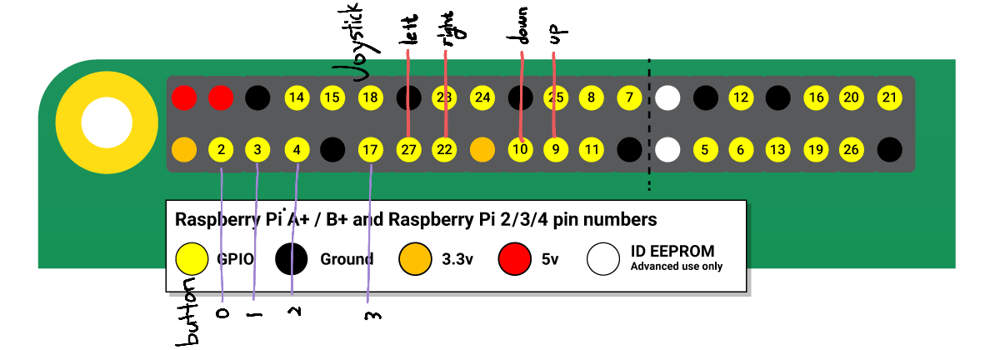
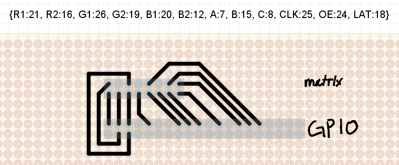

*Do you want to make game on LED matrix?*
# Make game on LED matrix
this repository can create a game on led matrix by adding some code.

Please feel free to open an issue or a pull-request if you have any idea to make it better. :)

> If you want a make game in windows, please see [hi-engine-2](https://github.com/BudlePlay/Hi-Engine2)  


## How to use
This repository is tested on Windows10, Visual studio 2019, Raspberry Pi 4.  

1. download visual studio and install iot and linux plugin.  
2. open *Hi-Engine2_forRaspberryPi/Hi-Engine2_forRaspberryPi.sln*
3. connect raspberry pi 
4. build and run

> We plan to support cmake.


## Strengths

### Utils
- raspberry pi를 gpio 핀을 입출력으로 사용할 수 있게 지원 [source](https://github.com/BudlePlay/make-game-on-led-matrix/blob/main/Hi-Engine2_forRaspberryPi/Hi-Engine2_forRaspberryPi/Engine/include/IORaspberryPi.h)

- 게임에 필요한 자료구조 지원 [source](https://github.com/BudlePlay/make-game-on-led-matrix/blob/main/Hi-Engine2_forRaspberryPi/Hi-Engine2_forRaspberryPi/Engine/include/Unit.h)

- 쉬운 scene 교체 [source](https://github.com/BudlePlay/make-game-on-led-matrix/blob/f0ab3596857c70902f1384795b2b583f1b65ddad/Hi-Engine2_forRaspberryPi/Hi-Engine2_forRaspberryPi/Engine/include/SceneManager.h#L34) [example](https://github.com/BudlePlay/make-game-on-led-matrix/blob/f0ab3596857c70902f1384795b2b583f1b65ddad/Hi-Engine2_forRaspberryPi/Hi-Engine2_forRaspberryPi/User/src/Player.cpp#L67)


### WorldOutliner

- WorldOutliner가 object를 관리함 [source](https://github.com/BudlePlay/make-game-on-led-matrix/blob/main/Hi-Engine2_forRaspberryPi/Hi-Engine2_forRaspberryPi/Engine/include/WorldOutliner.h)

- 어디서든 object 추가 가능 [source](https://github.com/BudlePlay/make-game-on-led-matrix/blob/f0ab3596857c70902f1384795b2b583f1b65ddad/Hi-Engine2_forRaspberryPi/Hi-Engine2_forRaspberryPi/Engine/include/WorldOutliner.h#L16) [example](https://github.com/BudlePlay/make-game-on-led-matrix/blob/f0ab3596857c70902f1384795b2b583f1b65ddad/Hi-Engine2_forRaspberryPi/Hi-Engine2_forRaspberryPi/User/src/Player.cpp#L54)


### Object
- [object](https://github.com/BudlePlay/make-game-on-led-matrix/blob/main/Hi-Engine2_forRaspberryPi/Hi-Engine2_forRaspberryPi/Engine/include/Object.h)를 상속받아 게임 속의 물체를 만들 수 있습니다.

- 이동 등 추상적인 함수 제공 [source](https://github.com/BudlePlay/make-game-on-led-matrix/blob/f0ab3596857c70902f1384795b2b583f1b65ddad/Hi-Engine2_forRaspberryPi/Hi-Engine2_forRaspberryPi/Engine/include/Object.h#L48) [example](https://github.com/BudlePlay/make-game-on-led-matrix/blob/f0ab3596857c70902f1384795b2b583f1b65ddad/Hi-Engine2_forRaspberryPi/Hi-Engine2_forRaspberryPi/User/src/Bullet.cpp#L21)

- 프로젝트 셋팅에서 입력 처리 등록 [source](https://github.com/BudlePlay/make-game-on-led-matrix/blob/main/Hi-Engine2_forRaspberryPi/Hi-Engine2_forRaspberryPi/ProjectSetting.h)

- object에서 이벤트 형식으로 함수를 등록해 입력 처리 [example](https://github.com/BudlePlay/make-game-on-led-matrix/blob/f0ab3596857c70902f1384795b2b583f1b65ddad/Hi-Engine2_forRaspberryPi/Hi-Engine2_forRaspberryPi/User/src/Player.cpp#L25)

- 충돌 처리를 이벤트 형식으로 사용 [source](https://github.com/BudlePlay/make-game-on-led-matrix/blob/f0ab3596857c70902f1384795b2b583f1b65ddad/Hi-Engine2_forRaspberryPi/Hi-Engine2_forRaspberryPi/Engine/include/Object.h#L57)


<br>

## Electric Circuit
### joystick, button
  

### LED matrix 
   

[LED matrix docs](https://learn.adafruit.com/32x16-32x32-rgb-led-matrix)  
[Raspberry pi GPIO docs](https://www.raspberrypi.org/documentation/usage/gpio/)  


### [Hardware](hardware/)
There is a drawing of the LED matrix stand and prop using fusion360.  

### SW pull up setting
if use joystick or button, need sw pull up setting in raspberry pi 4.  
```sh
git clone https://github.com/WiringPi/WiringPi.git
cd WiringPi/
./build
raspi-gpio set 9 pu
raspi-gpio set 10 pu
raspi-gpio set 27 pu
raspi-gpio set 22 pu
raspi-gpio set 2 pu
raspi-gpio set 3 pu
raspi-gpio set 4 pu
raspi-gpio set 17 pu 
sudo gpio readall
```

## Demo
  
  

[https://www.youtube.com/watch?v=Fkds48xTplY](https://www.youtube.com/watch?v=Fkds48xTplY)  
  


### Tech use in the demo
- C++
- LED Matrix 
- Raspberry Pi 4
- Fusion 360 [[link](hardware/)]
- 3d Printer
- Laser cutting machine

### Buy list
- [LED matrix](https://www.devicemart.co.kr/goods/view?no=1360878)  
- [Joy stick](https://www.devicemart.co.kr/goods/view?no=13152308)
- [Game switch](https://www.devicemart.co.kr/goods/view?no=1376727)
- Acrylic sheet 3t
  
## Reference
[HiEngine2](https://github.com/BudlePlay/Hi-Engine2)

## Contributors
[Songs](https://github.com/SHSongs)  
[kyh](https://github.com/1q2f3d)
