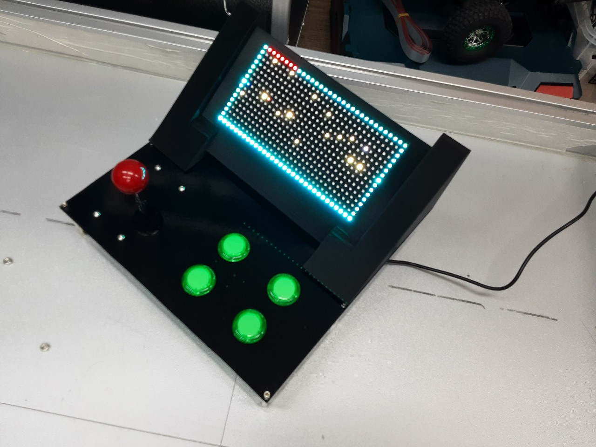
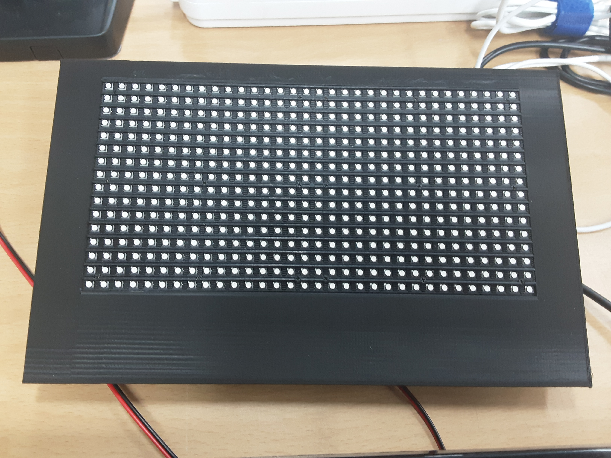
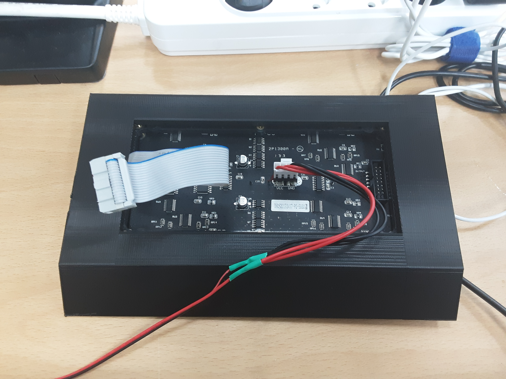
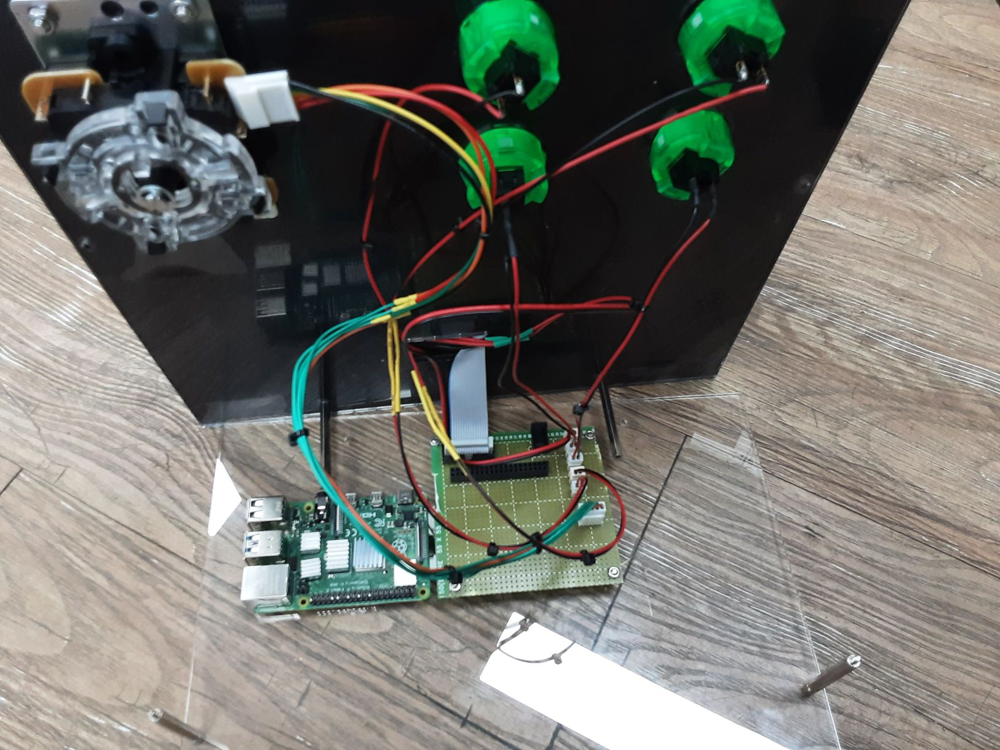
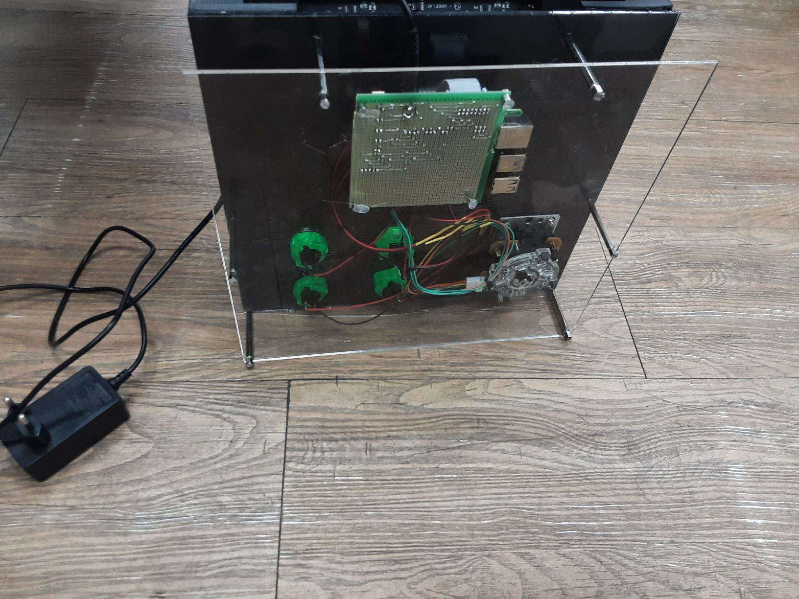

# Hi-Engine2_forLEDMatrix_Linux

  
  

[https://www.youtube.com/watch?v=Fkds48xTplY](https://www.youtube.com/watch?v=Fkds48xTplY)  
  

Hi-Engine2 를 기반으로 만든 LED 게임기  


## Tech
- C++
- LED Matrix
- Raspberry Pi 4
- Fusion 360
- 3d Printer
- Laser cutting machine

## Case

  

  
  
  
  

## SW Pull up Setting
```sh
git clone https://github.com/WiringPi/WiringPi.git
cd WiringPi/
./build
raspi-gpio set 9 pu
raspi-gpio set 10 pu
raspi-gpio set 27 pu
raspi-gpio set 22 pu
raspi-gpio set 2 pu
raspi-gpio set 3 pu
raspi-gpio set 4 pu
raspi-gpio set 17 pu 
sudo gpio readall
```

## Reference
[HiEngine2](https://github.com/BudlePlay/Hi-Engine2)

## Contributors
[Songs](https://github.com/SHSongs)  
[kyh](https://github.com/1q2f3d)